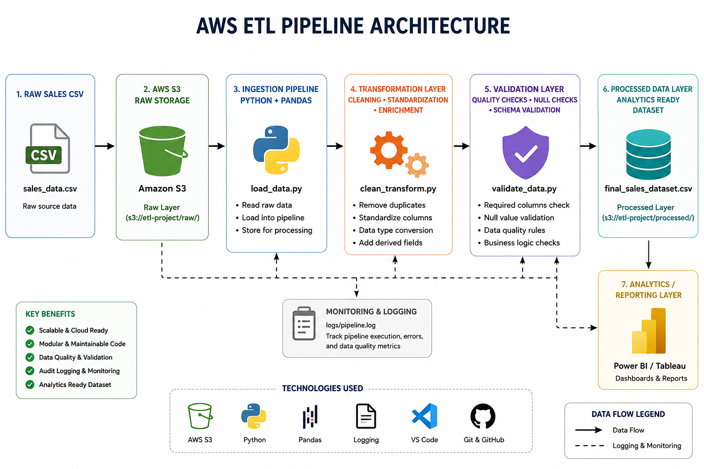

# AWS ETL Pipeline

## Overview

This project demonstrates a production-style AWS ETL pipeline using Python, Pandas, Docker, GitHub Actions, and cloud data engineering principles.

The pipeline simulates a modern cloud-native ETL workflow:
- Raw data ingestion
- Data transformation
- Data validation
- Logging & monitoring
- Processed analytics-ready output
- CI/CD automation
- Containerized execution

The project is designed to showcase real-world Data Engineering and Cloud Engineering practices commonly used in AWS-based analytics platforms.

---

## Project Status

✅ Active Portfolio Project  
✅ End-to-End ETL Pipeline  
✅ Logging & Monitoring  
✅ Data Validation Framework  
✅ Docker Containerization  
✅ CI/CD Integration  
✅ Cloud Architecture Design  

---

## Architecture Diagram



---

## Architecture Flow

```text
Raw CSV Data
      ↓
AWS S3 Raw Layer
      ↓
Ingestion Pipeline
      ↓
Transformation Layer
      ↓
Validation Layer
      ↓
Processed Data Layer
      ↓
Analytics / Reporting Layer
```

---

## Tech Stack

- Python
- Pandas
- NumPy
- AWS S3 Concepts
- Docker
- GitHub Actions
- Git
- VS Code
- Logging
- Data Validation
- CI/CD

---

## Key Features

- End-to-end ETL pipeline
- Modular project architecture
- Data ingestion workflow
- Data cleansing & transformation
- Data validation layer
- Logging & monitoring
- Processed analytics-ready dataset
- Dockerized pipeline execution
- GitHub Actions CI/CD integration
- Cloud-style engineering structure

---

## ETL Pipeline Components

### Ingestion Layer
- Reads raw sales dataset
- Simulates AWS S3 raw data ingestion
- Loads source data into processing workflow

### Transformation Layer
- Removes duplicates
- Standardizes column names
- Converts date formats
- Adds metadata timestamps
- Produces processed dataset

### Validation Layer
- Schema validation
- Null value checks
- Business rule validation
- Data quality checks

### Loading Layer
- Stores processed output dataset
- Simulates analytics-ready storage layer
- Prepares data for reporting tools

---

## Logging & Monitoring

The pipeline includes centralized logging using Python logging module.

Log file:

```text
logs/pipeline.log
```

Logged events:
- Pipeline execution status
- Ingestion completion
- Transformation completion
- Validation status
- Loading status
- Error tracking

---

## CI/CD Pipeline

This repository includes GitHub Actions CI/CD automation.

Pipeline workflow:
- Install dependencies
- Execute ETL pipeline
- Validate execution
- Automate pipeline testing

Workflow file:

```text
.github/workflows/ci-cd-pipeline.yml
```

---

## Docker Containerization

The ETL pipeline is fully containerized using Docker.

### Build Docker Image

```bash
docker build -t aws-etl-pipeline .
```

### Run Docker Container

```bash
docker run aws-etl-pipeline
```

### Docker Compose

```bash
docker-compose up
```

---

## Repository Structure

```text
aws-etl-pipeline/
│
├── data/
│   ├── raw/
│   │   └── sales_data.csv
│   │
│   └── processed/
│       ├── clean_sales_data.csv
│       └── final_sales_dataset.csv
│
├── src/
│   ├── ingestion/
│   │   └── load_data.py
│   │
│   ├── transformation/
│   │   └── clean_transform.py
│   │
│   ├── validation/
│   │   └── validate_data.py
│   │
│   ├── loading/
│   │   └── load_processed_data.py
│   │
│   ├── utils/
│   │   └── logger.py
│   │
│   └── main_pipeline.py
│
├── logs/
│   └── pipeline.log
│
├── visualizations/
│   └── aws-etl-architecture.png
│
├── tests/
│
├── .github/workflows/
│   └── ci-cd-pipeline.yml
│
├── Dockerfile
├── docker-compose.yml
├── requirements.txt
└── README.md
```

---

## How to Run the Project

### Clone Repository

```bash
git clone https://github.com/Kornelius99/aws-etl-pipeline.git
```

### Install Dependencies

```bash
pip install -r requirements.txt
```

### Run Full ETL Pipeline

```bash
python src/main_pipeline.py
```

---

## Engineering Concepts Demonstrated

- ETL Pipeline Development
- Cloud Data Engineering
- AWS-style Data Architecture
- Logging & Monitoring
- CI/CD Automation
- Docker Containerization
- Data Validation Frameworks
- Modular Python Engineering
- Analytics-ready Data Processing

---

## Future Enhancements

- Integrate real AWS S3
- Add AWS Glue jobs
- Load data into Redshift
- Implement Apache Airflow orchestration
- Add Terraform Infrastructure-as-Code
- Integrate Great Expectations validation
- Add unit tests with Pytest
- Add Power BI reporting layer
- Add streaming ingestion pipeline

---

## Business Use Case

This pipeline simulates a retail sales analytics workflow where raw transactional data is:
- ingested,
- cleaned,
- validated,
- transformed,
- and prepared for analytics reporting.

Potential use cases:
- Sales analytics platforms
- Retail reporting systems
- Financial reporting pipelines
- Cloud data warehouses
- Executive dashboards

---

## Author

Korneli Pingula  
Senior Data Platform & Analytics Engineer | AWS • Azure • Databricks • PySpark • SQL • Python • Power BI

LinkedIn:
linkedin.com/in/pingulakornelius

GitHub:
github.com/Kornelius99
